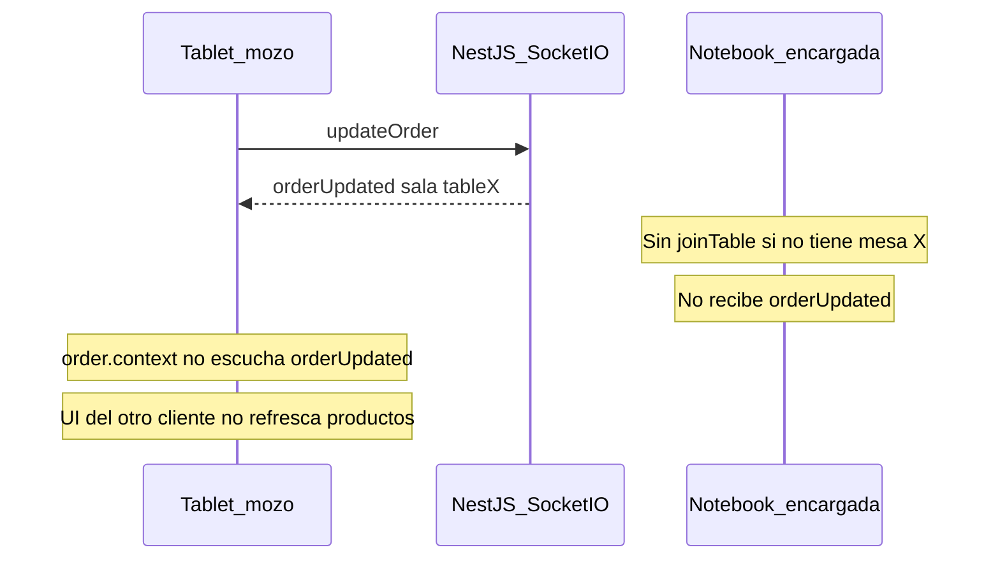

# Diagnóstico general — Hansel y Gretel App

Auditoría realizada el **10/08/2026**.  
Alcance: performance/consultas, WebSockets, seguridad, impresión y despliegue LAN.  
Este documento es un **informe para evaluación**. No implica cambios de código hasta que se apruebe cada fase.

Complementa (no reemplaza) el listado de frontend en [`mejoras.md`](mejoras.md) (auditoría 23/06/2026).

---

## Contexto de despliegue considerado

| Dispositivo | Rol | Cómo se usa |
|-------------|-----|-------------|
| Notebook (servidor) | Encargada | Levanta backend `:3000` + frontend `:3001`; stock, cobro, caja |
| Tablet (navegador LAN) | Mozo | Consume el front vía router; pedidos y mesas |
| Impresora comandera | — | Ethernet TCP raw puerto `9100` (IP hoy hardcodeada) |

Stack: NestJS + TypeORM + PostgreSQL + Socket.IO (backend) · Next.js 15 + Zustand + MUI (frontend).

---

## 1. Resumen ejecutivo

La aplicación es usable en producción local, pero presenta **brechas de autorización en la API**, **desincronización WS entre mozo y encargada**, **consultas e índices débiles** y una **impresión bloqueante** que afecta la UX en LAN.

### Riesgos más críticos (top 6)

1. **API parcialmente abierta en LAN** — registro de usuarios público, caja/export/impresora sin guard efectivo, `RolesGuard` con bypass si falta `@Roles`.
2. **Ediciones de orden abierta no se sincronizan bien** — `orderUpdated` solo a sala + `order.context` no lo escucha; cortes LAN pierden `joinTable`.
3. **Listeners WS duplicados en cada reconexión** — estados inconsistentes y memory leak.
4. **Cobro / stock sin transacciones atómicas** — riesgo de inconsistencia mesa/pagos/orden/stock.
5. **Impresión bloqueante + IP hardcodeada** — UI congelada 30–60 s si la impresora falla; comanda puede no salir a cocina.
6. **Dependencias vulnerables** — Next.js `15.0.3` con CVEs críticas; sin Dependabot.

### Severidad agregada (estimado)

| Frente | Críticos | Altos | Medios | Bajos |
|--------|----------|-------|--------|-------|
| Seguridad | ~8 | ~12 | ~10 | ~6 |
| WebSockets | ~3 | ~4 | ~4 | ~3 |
| Performance / consultas | ~2 | ~5 | ~6 | ~2 |
| Impresión / despliegue | ~1 | ~4 | ~4 | ~2 |

---

## 2. Seguridad

Severidad orientada a red LAN (router del local). Aunque no esté expuesta a Internet, cualquier dispositivo en la red puede alcanzar el backend.

### 2.1 Críticos

- [ ] **S-01 — `POST /user/register` público con escalada de rol**  
  **Archivo:** `backend/src/User/user.controller.ts` (~L12–54)  
  **Problema:** cualquiera puede crear usuarios con rol `Admin`/`Encargado` sin token. El front envía `Authorization` pero el backend no lo exige.  
  **Severidad:** Crítica · **Esfuerzo:** S (1–2 h)

- [ ] **S-02 — `register()` devuelve hash bcrypt**  
  **Archivo:** `backend/src/User/user.controller.ts` (~L51–53)  
  **Problema:** la respuesta incluye la entidad `User` con `password` hasheado.  
  **Severidad:** Crítica · **Esfuerzo:** S

- [ ] **S-03 — `RolesGuard` permite acceso anónimo si falta `@Roles`**  
  **Archivo:** `backend/src/Guards/roles.guard.ts` (~L24–26)  
  **Problema:** `if (!requiredRoles) return true`. Además solo lee `getHandler()`, no `getClass()` → `@Roles` a nivel de clase no aplica.  
  **Severidad:** Crítica · **Esfuerzo:** M (2–4 h)

- [ ] **S-04 — Caja diaria sin `@UseGuards(RolesGuard)`**  
  **Archivo:** `backend/src/daily-cash/daily-cash.controller.ts` (~L37–38)  
  **Problema:** abrir/cerrar caja, movimientos y métricas accesibles sin JWT. `@Roles` es decorativo.  
  **Severidad:** Crítica · **Esfuerzo:** S

- [ ] **S-05 — Export PDF / impresión de stock sin auth**  
  **Archivo:** `backend/src/ExportPdf/export.controller.ts` (~L14–60)  
  **Problema:** inventario descargable/imprimible por cualquiera en la LAN.  
  **Severidad:** Crítica · **Esfuerzo:** S

- [ ] **S-06 — Impresora sin auth**  
  **Archivo:** `backend/src/Printer/printer.controller.ts` (~L16–97)  
  **Problema:** spam de tickets/comandas y manipulación del flujo operativo.  
  **Severidad:** Crítica · **Esfuerzo:** S

- [ ] **S-07 — Next.js 15.0.3 con CVEs críticas**  
  **Archivo:** `frontend/package.json`  
  **Problema:** RCE / SSRF / bypass documentados en esa línea de versión.  
  **Severidad:** Crítica · **Esfuerzo:** M–L (actualizar y verificar build)

- [ ] **S-08 — Backend con decenas de vulnerabilidades en lockfile**  
  **Archivo:** `backend/package-lock.json`  
  **Problema:** critical/high en dependencias transitivas (`fast-xml-parser`, `handlebars`, etc.).  
  **Severidad:** Crítica / Alta · **Esfuerzo:** M–L

### 2.2 Altos

- [ ] **S-09 — ToppingsGroup y UnitOfMeasure sin guard**  
  **Archivos:** `backend/src/ToppingsGroup/toppings-group.controller.ts` (~L27–28), `backend/src/UnitOfMeasure/unitOfMeasure.controller.ts` (~L35–36)  
  **Severidad:** Alta · **Esfuerzo:** S

- [ ] **S-10 — Endpoints de producto sin `@Roles` pese a tener guard**  
  **Archivo:** `backend/src/Product/controllers/product.controller.ts` (~L133–187, ~L429–458)  
  **Problema:** `POST /product/prod-to-prom` y `POST /product/promo-with-slots` accesibles anónimamente por S-03.  
  **Severidad:** Alta · **Esfuerzo:** S

- [ ] **S-11 — `JWT_SECRET` sin fail-fast al arrancar**  
  **Archivo:** `backend/src/User/user.module.ts` (~L15)  
  **Problema:** `configService.get()` sin `getOrThrow`; secret `undefined` posible.  
  **Severidad:** Alta · **Esfuerzo:** S

- [ ] **S-12 — Sin Helmet / headers de seguridad**  
  **Archivo:** `backend/src/main.ts`  
  **Severidad:** Alta · **Esfuerzo:** S

- [ ] **S-13 — WebSocket sin autenticación**  
  **Archivos:** `backend/src/Real-time/real-time.gateway.ts` (~L40–57), `backend/src/Real-time/middleware/ws-auth.middleware.ts` (desactivado), `backend/src/Real-time/real-time.module.ts` (~L43–44)  
  **Problema:** cualquiera en la LAN puede unirse a salas `table:{id}` y recibir eventos.  
  **Severidad:** Alta · **Esfuerzo:** M

- [ ] **S-14 — Token JWT en `localStorage`**  
  **Archivos:** `frontend/app/context/authContext.tsx` (~L46–61), `frontend/app/views/login/page.tsx` (~L35)  
  **Problema:** vulnerable a XSS → robo de sesión.  
  **Severidad:** Alta · **Esfuerzo:** M–L (httpOnly cookie + ajustes CORS)

- [ ] **S-15 — Gateway legacy con `cors: true`**  
  **Archivo:** `backend/src/Gateways/events.gateway.ts` (~L11)  
  **Problema:** no está en `AppModule` hoy, pero es riesgo si se reactiva.  
  **Severidad:** Alta (latente) · **Esfuerzo:** S (eliminar o asegurar)

### 2.3 Medios / bajos (selección)

- [ ] **S-16 — `forbidNonWhitelisted: false`** · `backend/src/main.ts` (~L148–154) · Media · S  
- [ ] **S-17 — Body sin DTO en impresión** · `printer.controller.ts` (~L51, L68) · Media · S  
- [ ] **S-18 — `UpdateDailyCashDto` permite mutar totales financieros** · `backend/src/DTOs/update-daily-cash.dto.ts` · Media · S (combinado con S-04)  
- [ ] **S-19 — Protección de rutas solo client-side; token no se valida expiración en `ProtectedRoute`** · `frontend/components/ProtectedRoute/ProtectedRoute.tsx` · Media · M  
- [ ] **S-20 — Sin Dependabot / CI de auditoría** · `.github/` · Media · S  
- [ ] **S-21 — Sin refresh token; JWT 120m** · `user.module.ts` · Media · M  
- [ ] **S-22 — Payload JWT sin `sub`/`userId`** · `user.service.ts` (~L71–72) · Media · S  
- [ ] **S-23 — Contraseña sin `@MinLength` en DTO** · `register-user.dto.ts` · Baja · S  
- [ ] **S-24 — `JwtExceptionFilter` no registrado globalmente** · `token.filters.ts` / `main.ts` · Baja · S  
- [ ] **S-25 — Auth middleware HTTP no verifica token** · `auth.middleware.ts` · Baja (código muerto) · S

### Notas positivas de seguridad

- Login con bcrypt (cost 10), rate limit en `/user/login`.
- CORS HTTP/WS restringido a `ALLOWED_ORIGINS` (no `*`) cuando está bien configurado.
- `.env` en `.gitignore`; Swagger solo en development.
- Stock y varios endpoints de Order sí usan `@UseGuards` + `@Roles` cuando el guard funciona.

---

## 3. Sincronización en tiempo real (WebSockets)

Arquitectura actual:

```text
Servicio de dominio → EventEmitter2 → *WSListener → BroadcastService → RealTimeGateway (Socket.IO)
```

Impresora: **no usa Socket.IO**; es TCP raw en `PrinterService`.

### 3.1 Críticos / altos (impacto diario mozo ↔ encargada)

- [ ] **WS-01 — `orderUpdated` solo a sala `table:{id}` y el mapa de mesas no hace `joinTable`**  
  **Backend:** `backend/src/Real-time/listeners/order-events.listener.ts` (~L17–24)  
  **Frontend:** `frontend/app/context/order.context.tsx` (~L198–207) — único `joinTable`  
  **Problema:** la encargada sin mesa seleccionada **no recibe** ediciones de líneas. Dos mozos en la misma mesa tampoco sincronizan productos confirmados vía UI del contexto.  
  **Severidad:** Alta · **Esfuerzo:** M

- [ ] **WS-02 — `order.context` no escucha `orderCreated` / `orderUpdated`**  
  **Archivo:** `frontend/app/context/order.context.tsx` (~L499–704)  
  **Problema:** solo reacciona a ticket/pending/close/delete (y en ticket hace re-fetch REST). Cambios de productos en orden abierta no refrescan la UI del otro cliente.  
  **Severidad:** Alta · **Esfuerzo:** M

- [ ] **WS-03 — Sin `joinTable` tras reconexión**  
  **Archivos:** `frontend/services/websocket.service.ts`, `order.context.tsx`  
  **Problema:** tras un corte WiFi/LAN se pierde la membresía de sala → dejan de llegar eventos room-scoped.  
  **Severidad:** Alta · **Esfuerzo:** S–M

- [ ] **WS-04 — Listeners duplicados en cada `reconnect`**  
  **Archivo:** `frontend/services/websocket.service.ts` (~L53–60)  
  **Problema:** `socket.on` sin `off` previo → handlers N veces, estados inconsistentes, memory leak.  
  **También listado en** `mejoras.md` ítem 3.  
  **Severidad:** Crítica · **Esfuerzo:** S

- [ ] **WS-05 — Riesgo de sockets duplicados si `connected === false`**  
  **Archivo:** `frontend/services/websocket.service.ts` (~L10–27)  
  **Problema:** crea un nuevo `io()` sin destruir el anterior.  
  **Severidad:** Alta · **Esfuerzo:** S

### 3.2 Payloads y consistencia de estado

- [ ] **WS-06 — `orderDeleted` (admin) emite payload incorrecto**  
  **Backend:** `order.service.ts` (~L622) emite `{orderId}`; listener usa `event.order` → WS con `undefined`. Front espera `data.id`.  
  **Severidad:** Media · **Esfuerzo:** S

- [ ] **WS-07 — `useOrderStore` escribe `status` en vez de `state`**  
  **Archivo:** `frontend/components/Order/useOrderStore.ts` (~L38–75)  
  **Problema:** en `orderUpdatedPending` / `orderUpdatedClose` / `orderTicketPrinted`. La app lee `state`.  
  **También en** `mejoras.md` ítem 21.  
  **Severidad:** Media · **Esfuerzo:** S

- [ ] **WS-08 — `categoryDeleted` emite `UpdateResult` en lugar de UUID**  
  **Archivo:** `backend/src/Category/category.service.ts` (~L83–85)  
  **Severidad:** Media · **Esfuerzo:** S

- [ ] **WS-09 — Entidad Order WS vs `IOrderDetails` del front**  
  **Problema:** backend emite `orderDetails[]`; UI espera `products[]`. El contexto compensa con fetch solo en algunos eventos.  
  **Severidad:** Media · **Esfuerzo:** M (normalizar payload o siempre re-fetch puntual)

### 3.3 Eventos faltantes / cadenas rotas

| Evento / dominio | Estado | Impacto |
|------------------|--------|---------|
| `stock.created/updated/deducted` | Listener espera `createStock`/`updateStock`/`deductStock`; servicio emite `stock.*` → **WS inoperante** | Stock no se sincroniza entre dispositivos |
| `stock.restored` | Sin listener WS | Ídem |
| `dailyCashOpened/Updated/Closed` | Backend emite; **front no escucha** | Caja desfasada entre notebook/tablet |
| Movimientos de caja | **No emiten WS** | Ídem |
| `printerError` | Backend emite; **front no escucha** | Mozo no ve fallo de impresora salvo HTTP |
| `toppingsGroup*` / `toppingUpdated` | Sin listener front | Admin desincronizado |
| `ingredient*` | Store Zustand existe pero **nunca se importa**; `ingredientsContext` solo REST | Sin sync WS |
| `orderDetails*` | Listener huérfano; **nadie emite** en dominio | Código muerto |
| `actualizacion` (legacy) | Gateway no registrado | Código muerto |

Checkboxes:

- [ ] **WS-10 — Reparar pipeline WS de stock** (nombres de eventos + payload útil + listeners front) · Alta · M  
- [ ] **WS-11 — Sync de caja diaria vía WS (o resync REST al evento)** · Media · M  
- [ ] **WS-12 — Escuchar `printerError` en front (Swal / banner)** · Media · S  
- [ ] **WS-13 — Listeners toppings / ingredientes o eliminar código muerto** · Baja · S–M  
- [ ] **WS-14 — Eliminar listeners/gateway legacy huérfanos** · Baja · S

### 3.4 Estrategia de reconexión actual

| Componente | Tras reconectar |
|------------|-----------------|
| `websocket.service` | Re-registra listeners (con bug WS-04); **no** re-join sala |
| `useTableStore` | Re-fetch REST de mesas de la sala · OK |
| `useOrderStore` / `useOrder` | **No** re-fetch de órdenes activas |
| `order.context` | **No** re-join mesa seleccionada |
| Productos / categorías | Solo confían en WS |

- [ ] **WS-15 — Resync REST de órdenes activas + re-join mesa al reconectar** · Alta · M

### Diagrama del gap principal (editar orden)



---

## 4. Performance y consultas (PostgreSQL / TypeORM)

### 4.1 Índices

Hoy casi no hay índices explícitos más allá de uniques y el índice parcial `UQ_active_order_per_table` (`migration/1780790400000-AddUniqueActiveOrderPerTable.ts`). PostgreSQL **no indexa FKs automáticamente**.

- [ ] **P-01 — Migración de índices prioritarios**  
  Candidatos:  
  - `orders(state, isActive)`, `orders(dailyCashId)`, `orders(date)`  
  - `order_details(orderId)` (parcial `WHERE isActive`), `order_payments(orderId)`  
  - `cash_movements(dailyCashId, type)`, `cash_movements(createdAt)`  
  - `daily_cash(date)`, `daily_cash(state)`  
  - `tables(roomId, isActive)`, `product_categories(categoryId)`, `promotion_slot_assignments(promotionId)`  
  **Severidad:** Alta · **Esfuerzo:** M

- [ ] **P-02 — Evaluar `pg_trgm` para búsquedas `ILIKE '%...%'`**  
  **Archivos:** `product.repository.ts`, `table.repository.ts`  
  **Severidad:** Media · **Esfuerzo:** M

### 4.2 Listados y N+1

- [ ] **P-03 — `getAllProducts` con ~14 relaciones**  
  **Archivo:** `backend/src/Product/repositories/product.repository.ts` (~L56–84)  
  **Front:** `useProducts` pide `limit=500` (`mejoras.md` ítem 19).  
  **Severidad:** Alta · **Esfuerzo:** M (DTOs livianos / vistas admin vs ordering)

- [ ] **P-04 — `GET /daily-cash` con `limit=1000` + `movements` + `orders` + `payments`**  
  **Archivos:** `daily-cash.controller.ts` (~L194–195), `daily-cash.repository.ts` (~L24–28)  
  **Severidad:** Alta · **Esfuerzo:** M

- [ ] **P-05 — `GET /order/active` sin paginación**  
  **Archivo:** `order.repository.ts` (~L38–47) — hoy liviano (solo `table`), pero crece con el día.  
  **Severidad:** Media · **Esfuerzo:** S

- [ ] **P-06 — N+1 en `buildOrderDetailWithToppings` y `updateOrder`**  
  **Archivos:** `order.repository.ts` (~L246–390), `order.service.ts` (~L168–270)  
  **Severidad:** Alta · **Esfuerzo:** L

- [ ] **P-07 — Métricas anuales ~36 queries (loop mensual)**  
  **Archivo:** `daily-cash.service.ts` (~L742–875)  
  **Severidad:** Media · **Esfuerzo:** M

- [ ] **P-08 — `GET /tables/:id` carga historial completo de órdenes y filtra en JS**  
  **Archivo:** `table.repository.ts` (~L155–159)  
  **Severidad:** Media · **Esfuerzo:** S

- [ ] **P-09 — Bug paginación Stock: `@Param` en vez de `@Query`**  
  **Archivo:** `backend/src/Stock/stock.controller.ts` (~L52–56)  
  **Severidad:** Media · **Esfuerzo:** S

- [ ] **P-10 — `eager: true` oculto**  
  **Archivos:** `order.entity.ts` (dailyCash), `unitOfMesure.entity.ts`, `promotion-slot-option.entity.ts`, etc.  
  **Severidad:** Media · **Esfuerzo:** M

### 4.3 Transacciones y consistencia

- [ ] **P-11 — Cerrar orden (cobrar) sin transacción**  
  **Archivo:** `order.repository.ts` (~L54–177) — saves separados de payments / table / order.  
  **Severidad:** Crítica · **Esfuerzo:** M

- [ ] **P-12 — `deductStock` fuera de la transacción de `updateOrder`**  
  **Archivo:** `order.service.ts` (~L265–270) — rollback de orden no revierte stock.  
  **Severidad:** Crítica · **Esfuerzo:** M–L

- [ ] **P-13 — `markOrderAsPendingPayment` y cierre de caja con updates sueltos**  
  **Archivos:** `order.service.ts` (~L643–680), `daily-cash.service.ts` (~L156+)  
  **Severidad:** Media · **Esfuerzo:** M

### 4.4 Configuración TypeORM / pool

- [ ] **P-14 — Pool de conexiones sin tuning**  
  **Archivos:** `backend/config/typeORMconfig.ts`, `app.module.ts`  
  **Problema:** defaults (~10); bajo WS + mozos + caja puede saturar.  
  **Severidad:** Media · **Esfuerzo:** S

- [ ] **P-15 — Observabilidad de queries lentas**  
  **Problema:** logging solo `error`/`warn`; sin métricas de duración.  
  **Severidad:** Baja · **Esfuerzo:** S–M

Buenas prácticas ya presentes: `synchronize: false`, `searchForOrdering` con relaciones acotadas, QueryBuilder de mesas con join condicional, índice único parcial de orden activa por mesa.

---

## 5. Impresión y despliegue LAN

### 5.1 Impresora comandera

- [ ] **I-01 — IP/puerto hardcodeados**  
  **Archivo:** `backend/src/Printer/printer.service.ts` (~L20–24) — `192.168.70.3:9100`  
  **Acción:** `PRINTER_HOST`, `PRINTER_PORT`, `PRINTER_TIMEOUT` en env.  
  **Severidad:** Alta · **Esfuerzo:** S

- [ ] **I-02 — Impresión bloqueante dentro de la request (y a veces de la TX)**  
  **Archivos:** `order.service.ts` (`updateOrder` imprime antes del commit; `markOrderAsPendingPayment` await print)  
  **Problema:** hasta ~31 s × reintentos; comanda 2 copias → UI con `LoadingLottie` congelada 30–60 s.  
  **Severidad:** Alta · **Esfuerzo:** L (cola / fire-and-forget + aviso WS)

- [ ] **I-03 — Comanda puede no salir a cocina aunque el pedido quede OK**  
  **Archivo:** `order.service.ts` (~L468–474) — warning HTTP; sin cola de reintento.  
  **Severidad:** Alta (operativo) · **Esfuerzo:** M

- [ ] **I-04 — `printerError` no se muestra en front**  
  Relacionado con WS-12.  
  **Severidad:** Media · **Esfuerzo:** S

- [ ] **I-05 — Reimpresión de ticket `POST /printer/printTicket/:id` probablemente rota**  
  **Archivos:** `printer.controller.ts` (~L55–69), `frontend/api/order.ts` (~L42–56)  
  **Problema:** no carga la orden de BD; pasa body vacío.  
  **Severidad:** Alta · **Esfuerzo:** S–M

- [ ] **I-06 — Dependencias ESC/POS instaladas pero no usadas; USB constants muertas**  
  **Archivos:** `package.json` (`escpos*`, `serialport`), `printer.constants.ts`  
  **Severidad:** Baja · **Esfuerzo:** S (limpiar o documentar)

- [ ] **I-07 — Contador de comandas en `print-counter.json`**  
  **Riesgo:** se resetea según despliegue/build.  
  **Severidad:** Media · **Esfuerzo:** M (persistir en BD)

### 5.2 Despliegue / red

- [ ] **I-08 — `PORT`/`HOST` documentados pero no usados; listen hardcodeado a 3000**  
  **Archivo:** `backend/src/main.ts` (~L166)  
  **Severidad:** Media · **Esfuerzo:** S

- [ ] **I-09 — Sin `.env.example` (backend y frontend)**  
  **Severidad:** Media · **Esfuerzo:** S  
  Variables críticas LAN: `ALLOWED_ORIGINS`, `NEXT_PUBLIC_API_URL`, `NEXT_PUBLIC_WS_URL`, `NODE_ENV=production` (sin esto **no imprime**).

- [ ] **I-10 — Documentar checklist de despliegue LAN**  
  Notebook accesible por IP; tablet no debe usar `localhost`; CORS con origen de la tablet; impresora en misma subred.  
  **Severidad:** Media · **Esfuerzo:** S

- [ ] **I-11 — Sin Docker Compose** (opcional; hoy scripts BAT Windows)  
  **Severidad:** Baja · **Esfuerzo:** L (si se desea)

### Flujo LAN actual (ticket)

```mermaid
sequenceDiagram
  participant Tablet as Tablet_browser
  participant Notebook as Backend_3000
  participant Printer as Impresora_9100

  Tablet->>Notebook: POST order pending
  Notebook->>Notebook: Guarda PENDING_PAYMENT
  Notebook->>Printer: TCP ESC POS
  alt OK
    Notebook-->>Tablet: 200 orden
  else Offline
    Notebook-->>Tablet: 200 + printerWarning
    Note over Tablet: Estado ya cambiado; papel no salio
  end
```

---

## 6. Relación con `mejoras.md` (frontend previo)

Ítems de [`mejoras.md`](mejoras.md) que **siguen abiertos** y se solapan con este diagnóstico:

| Ítem mejoras.md | Relación |
|-----------------|----------|
| 3 — listeners WS duplicados | = WS-04 (Fase 1) |
| 4–10 — críticos React/auth | Mantener en Fase 0/1 según impacto |
| 11–20 — performance front | Fase 3 / Fase 4 |
| 21 — `status` vs `state` | = WS-07 |

Ítems ya cerrados en `mejoras.md`: filtro `categoryDeleted` (store), guard anti doble submit en `Pay.tsx`.

---

## 7. Plan de trabajo por fases

Orden **mixto por severidad e impacto operativo**. Cada fase debería cerrarse con smoke test en LAN (notebook + tablet + impresora).

### Fase 0 — Contención de seguridad (prioridad máxima)

**Objetivo:** la API en LAN deja de estar efectivamente abierta.

- [ ] S-03 — Corregir `RolesGuard` (exigir token; denegar si no hay roles cuando el guard está aplicado; leer también `getClass()`)
- [ ] S-01 / S-02 — Proteger `POST /user/register` (solo Admin) y no devolver `password`
- [ ] S-04, S-05, S-06, S-09 — Aplicar `@UseGuards(RolesGuard)` + `@Roles` en daily-cash, export, printer, toppings, unitofmeasure
- [ ] S-10 — Completar `@Roles` en endpoints de producto huérfanos
- [ ] S-12 / S-16 — Helmet + `forbidNonWhitelisted: true`
- [ ] S-11 — `JWT_SECRET` con `getOrThrow` / validación al bootstrap
- [ ] Smoke: intentar llamar caja/impresora/register sin token → 401/403

**Esfuerzo estimado:** 1–2 días.

### Fase 1 — Sincronización WS (impacto diario)

**Objetivo:** mozo y encargada ven el mismo estado de mesas/órdenes tras cortes LAN.

- [ ] WS-04 / WS-05 — Deduplicar listeners; no crear sockets huérfanos
- [ ] WS-03 / WS-15 — Re-`joinTable` + resync REST de órdenes activas al reconectar
- [ ] WS-01 / WS-02 — Escuchar `orderUpdated`/`orderCreated` en `order.context` (o emitir también globalmente + invalidar caché de mesas)
- [ ] WS-06 / WS-07 / WS-08 — Payloads y `state` vs `status`
- [ ] WS-12 — UI para `printerError`
- [ ] Smoke: editar pedido en tablet → notebook refleja; cortar WiFi 10 s → rejoin y estado coherente

**Esfuerzo estimado:** 2–4 días.

### Fase 2 — Robustez de impresión

**Objetivo:** no congelar la UI; no perder comanda sin aviso claro; config flexible.

- [ ] I-01 — IP/puerto/timeout por env
- [ ] I-02 — Sacár impresión de la transacción; timeout corto; preferible cola/async + evento WS
- [ ] I-03 — Banner/cola de reimpresión cuando falle comanda
- [ ] I-05 — Fix reimpresión de ticket (cargar orden por id)
- [ ] I-09 / I-10 — `.env.example` + checklist LAN (`NODE_ENV=production`, `ALLOWED_ORIGINS`, `NEXT_PUBLIC_*`)
- [ ] Smoke: apagar impresora → pedido se guarda, UI no cuelga >5–10 s, aviso visible, reimpresión OK

**Esfuerzo estimado:** 2–3 días.

### Fase 3 — Performance y consultas

**Objetivo:** respuesta estable con 2 clientes + caja + stock.

- [ ] P-11 / P-12 — Transacciones en cobro y stock acoplado al pedido
- [ ] P-01 — Migración de índices
- [ ] P-03 / P-04 / P-09 — Aligerar listados y arreglar paginación stock
- [ ] P-06 / P-10 — Reducir N+1 y `eager` innecesarios
- [ ] P-14 — Tuning de pool
- [ ] Front: selectores Zustand / `useMemo` en contextos (`mejoras.md` 11–13, 16–17)
- [ ] Smoke: abrir sala + editar 3 mesas + cobro + listar productos sin demoras notables

**Esfuerzo estimado:** 3–5 días.

### Fase 4 — Higiene, dependencias y deuda restante

- [ ] S-07 / S-08 / S-20 — Actualizar Next.js y deps; Dependabot
- [ ] S-13 / S-14 — Auth WS y (opcional) cookie httpOnly
- [ ] WS-10 / WS-11 / WS-13 / WS-14 — Stock/caja/toppings sync o limpieza
- [ ] I-06 / I-07 / I-08 — Limpieza impresora, contador en BD, PORT/HOST
- [ ] Cerrar ítems abiertos de `mejoras.md` (4–10, 14–36) no absorbidos arriba
- [ ] Eliminar gateway legacy `EventsGateway` / listeners muertos

**Esfuerzo estimado:** 3–6 días (depende del alcance de upgrades).

---

## 8. Criterios de aceptación globales (post-fases)

1. Sin token válido no se puede registrar usuarios, abrir/cerrar caja, exportar stock ni imprimir.
2. Con 2 clientes (encargada + mozo), editar una orden abierta actualiza la UI del otro en ≤2 s (o tras resync explícito al reconectar).
3. Tras reconexión WS no hay handlers duplicados ni sala “perdida”.
4. Fallo de impresora: pedido/caja no se corrompen; UI responde; hay camino claro de reimpresión.
5. Cobro y descuento de stock son atómicos (sin estados a medias).
6. Listados de productos/caja no traen por defecto miles de filas con relaciones profundas.

---

## 9. Fuera de alcance de este informe

- Implementación de las fases (se hará tras evaluación).
- Rediseño de UX, facturación fiscal electrónica, multi-sucursal.
- Benchmarks de carga formales (k6/Artillery): recomendable después de Fase 3.

---

## 10. Referencias rápidas de archivos clave

| Área | Paths |
|------|-------|
| Auth / roles | `backend/src/Guards/roles.guard.ts`, `backend/src/User/user.controller.ts`, `backend/src/main.ts` |
| WS gateway | `backend/src/Real-time/real-time.gateway.ts`, `broadcast.service.ts`, `listeners/*` |
| WS front | `frontend/services/websocket.service.ts`, `app/context/order.context.tsx`, `components/*/use*Store.ts` |
| Órdenes / stock | `backend/src/Order/services/order.service.ts`, `Order/repositories/order.repository.ts`, `Stock/stock.service.ts` |
| Impresión | `backend/src/Printer/printer.service.ts`, `printer.controller.ts` |
| Front críticos previos | [`mejoras.md`](mejoras.md) |

---

*Informe generado para evaluación — 10/08/2026.*
