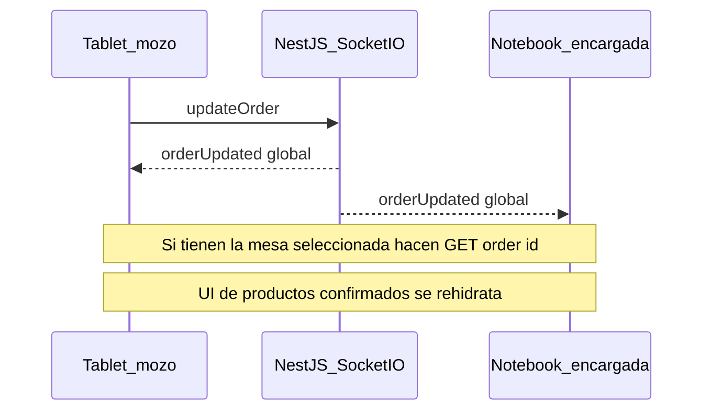

# Diagnóstico general — Hansel y Gretel App

Auditoría realizada el **10/08/2026**.  
Última conciliación con código/git: **24/09/2026**.  
Alcance: performance/consultas, WebSockets, seguridad, impresión y despliegue LAN.  
Este documento es un **informe para evaluación**. No implica cambios de código hasta que se apruebe cada fase.

Complementa (no reemplaza) el listado de frontend en [`mejoras.md`](mejoras.md) (auditoría 23/06/2026).

### Estado al 24/09/2026 — para avanzar

| Frente | Estado | Notas |
|--------|--------|--------|
| **Fase 1 — WS órdenes/mesas** | Hecha y testeada en LAN (10/08/2026) | Queda WS-10 stock; caja (WS-11) ya sync |
| **Fase 0 PR A–C — auth HTTP** | Hecha (19/08/2026) | Register, caja, export, impresora, toppings, UoM, productos; `RolesGuard` endurecido |
| **Fase 0 PR D — Helmet + `forbidNonWhitelisted`** | **Diferido** (análisis 19/08/2026) | S-16 puede romper caja/productos/unidades; Helmet aporta poco en LAN |
| **Fase 2 — impresora** | Hecha (24/09/2026) | Env `PRINTER_*`, print post-commit, timeout 4s / 1 intento, reprint ticket por id, avisos unificados |
| **Fase 3 — TX/consultas** | **Hecha (código 24/09/2026)** | Cobro y `deductStock` en la misma TX; índices; listados livianos; pool; front 11–13 y 16–17 |
| **Fase 4 — deps / auth WS / cookie** | Pendiente | Next 15.0.3; WS sin JWT; token en `localStorage` |

---

## Contexto de despliegue considerado

| Dispositivo | Rol | Cómo se usa |
|-------------|-----|-------------|
| Notebook (servidor) | Encargada | Levanta backend `:3000` + frontend `:3001`; stock, cobro, caja |
| Tablet (navegador LAN) | Mozo | Consume el front vía router; pedidos y mesas |
| Impresora comandera | — | Ethernet TCP raw puerto `9100` (IP hoy hardcodeada) |

Stack: NestJS + TypeORM + PostgreSQL + Socket.IO (backend) · Next.js 15 + Zustand + MUI (frontend).

---

## 1. Resumen ejecutivo

La aplicación es usable en producción local. **Auth HTTP de Fase 0 (PR A–C), sync WS de órdenes (Fase 1), impresión (Fase 2) y TX/consultas (Fase 3) ya están en código.** Siguen abiertos: **deps (Next 15.0.3)** y **auth WS / cookie**.

### Riesgos más críticos (top 6)

1. ~~**API parcialmente abierta en LAN**~~ — **Mitigado PR A–C.** Quedan Helmet (diferido), cookie httpOnly y auth WS (Fase 4).
2. ~~**Ediciones de orden abierta no se sincronizan bien**~~ — **Mitigado Fase 1** (`orderUpdated` global + refetch en contexto + re-join).
3. ~~**Listeners WS duplicados en cada reconexión**~~ — **Resuelto Fase 1**.
4. ~~**Cobro / stock sin transacciones atómicas**~~ — **Mitigado Fase 3:** `closeOrder` y `deductStock` usan `QueryRunner` (mismo patrón que `restoreStock`).
5. ~~**Impresión bloqueante + IP hardcodeada**~~ — **Mitigado Fase 2:** env `PRINTER_*`, print después del commit, timeout 4 s / 1 intento, reprint de ticket por id, aviso + reimpresión manual. Queda I-07 (contador en BD).
6. **Dependencias vulnerables** — Next.js `15.0.3` con CVEs críticas; sin Dependabot. *(Fase 4)*

### Severidad agregada (estimado)

| Frente | Críticos | Altos | Medios | Bajos |
|--------|----------|-------|--------|-------|
| Seguridad | ~8 | ~12 | ~10 | ~6 |
| WebSockets | ~3 | ~4 | ~4 | ~3 |
| Performance / consultas | ~2 | ~5 | ~6 | ~2 |
| Impresión / despliegue | ~1 | ~4 | ~4 | ~2 |

---

## 2. Seguridad

Severidad orientada a red LAN (router del local). Aunque no esté expuesta a Internet, cualquier dispositivo en la red puede alcanzar el backend.

### 2.1 Críticos

- [x] **S-01 — `POST /user/register` público con escalada de rol**  
  **Resuelto (Fase 0 PR A, 19/08/2026):** requiere JWT + rol Admin o Encargado. Encargado no puede crear Admin/Encargado.

- [x] **S-02 — `register()` devuelve hash bcrypt**  
  **Resuelto (Fase 0 PR A, 19/08/2026):** la respuesta omite `password`.

- [x] **S-03 — `RolesGuard` permite acceso anónimo si falta `@Roles`**  
  **Resuelto (Fase 0 PR C, 19/08/2026):** sin `@Roles` (handler ni clase) → 403. Sin token / token inválido o vencido → 401. Rol no permitido → 403. Mensajes en español.

- [x] **S-04 — Caja diaria sin `@UseGuards(RolesGuard)`**  
  **Resuelto (Fase 0 PR A, 19/08/2026):** guard + roles Admin/Encargado (métodos ya tenían `@Roles`).

- [x] **S-05 — Export PDF / impresión de stock sin auth**  
  **Resuelto (Fase 0 PR A, 19/08/2026):** Admin / Encargado / Inventario.

- [x] **S-06 — Impresora sin auth**  
  **Resuelto (Fase 0 PR A, 19/08/2026):** Admin / Encargado / Mozo / Inventario.

- [ ] **S-07 — Next.js 15.0.3 con CVEs críticas**  
  **Archivo:** `frontend/package.json`  
  **Problema:** RCE / SSRF / bypass documentados en esa línea de versión.  
  **Severidad:** Crítica · **Esfuerzo:** M–L (actualizar y verificar build)

- [ ] **S-08 — Backend con decenas de vulnerabilidades en lockfile**  
  **Archivo:** `backend/package-lock.json`  
  **Problema:** critical/high en dependencias transitivas (`fast-xml-parser`, `handlebars`, etc.).  
  **Severidad:** Crítica / Alta · **Esfuerzo:** M–L

### 2.2 Altos

- [x] **S-09 — ToppingsGroup y UnitOfMeasure sin guard**  
  **Resuelto (Fase 0 PR A, 19/08/2026):** `@UseGuards(RolesGuard)` + `@Roles` en `GET conversion`.

- [x] **S-10 — Endpoints de producto sin `@Roles` pese a tener guard**  
  **Resuelto (Fase 0 PR B, 19/08/2026):** `@Roles(ADMIN, ENCARGADO)` en `POST /product/prod-to-prom` y `POST /product/promo-with-slots`. Fallback de clase en `ProductController` y `PromotionSlotController`. `RolesGuard` lee handler + class (`getAllAndOverride`). Endpoints de slot comentados siguen muertos.

- [x] **S-11 — `JWT_SECRET` sin fail-fast al arrancar**  
  **Resuelto (Fase 0 PR A, 19/08/2026):** `configService.getOrThrow('JWT_SECRET')`.

- [ ] **S-12 — Sin Helmet / headers de seguridad**  
  **Archivo:** `backend/src/main.ts`  
  **Severidad:** Alta · **Esfuerzo:** S  
  **Diferido (PR D, 19/08/2026):** valor bajo en LAN HTTP; un default de Helmet puede romper tablet (`:3001`→`:3000`) y Swagger. Solo con config de API/CORS (CSP off, CORP `cross-origin`).

- [ ] **S-13 — WebSocket sin autenticación**  
  **Archivos:** `backend/src/Real-time/real-time.gateway.ts` (~L40–57), `backend/src/Real-time/middleware/ws-auth.middleware.ts` (desactivado), `backend/src/Real-time/real-time.module.ts` (~L43–44)  
  **Problema:** cualquiera en la LAN puede unirse a salas `table:{id}` y recibir eventos.  
  **Severidad:** Alta · **Esfuerzo:** M

- [ ] **S-14 — Token JWT en `localStorage`**  
  **Archivos:** `frontend/app/context/authContext.tsx` (~L46–61), `frontend/app/views/login/page.tsx` (~L35)  
  **Problema:** vulnerable a XSS → robo de sesión.  
  **Severidad:** Alta · **Esfuerzo:** M–L (httpOnly cookie + ajustes CORS)

- [ ] **S-15 — Gateway legacy con `cors: true`**  
  **Archivo:** `backend/src/Gateways/events.gateway.ts` (~L11)  
  **Problema:** no está en `AppModule` hoy, pero es riesgo si se reactiva.  
  **Severidad:** Alta (latente) · **Esfuerzo:** S (eliminar o asegurar)

### 2.3 Medios / bajos (selección)

- [ ] **S-16 — `forbidNonWhitelisted: false`** · `backend/src/main.ts` (~L148–154) · Media · S  
  **Diferido (PR D, 19/08/2026):** `whitelist: true` ya descarta extras. Activar el 400 rompe flujos actuales (cerrar caja con `initialCash`, editar unidad/`id`, crear/editar producto e ingrediente). No hacer sin alinear DTOs/front.
- [ ] **S-17 — Body sin DTO en impresión** · `printer.controller.ts` (~L51, L68) · Media · S  
- [ ] **S-18 — `UpdateDailyCashDto` permite mutar totales financieros** · `backend/src/DTOs/update-daily-cash.dto.ts` · Media · S (combinado con S-04)  
- [ ] **S-19 — Protección de rutas solo client-side; token no se valida expiración en `ProtectedRoute`** · `frontend/components/ProtectedRoute/ProtectedRoute.tsx` · Media · M  
- [ ] **S-20 — Sin Dependabot / CI de auditoría** · `.github/` · Media · S  
- [ ] **S-21 — Sin refresh token; JWT 120m** · `user.module.ts` · Media · M  
- [ ] **S-22 — Payload JWT sin `sub`/`userId`** · `user.service.ts` (~L71–72) · Media · S  
- [ ] **S-23 — Contraseña sin `@MinLength` en DTO** · `register-user.dto.ts` · Baja · S  
- [ ] **S-24 — `JwtExceptionFilter` no registrado globalmente** · `token.filters.ts` / `main.ts` · Baja · S  
  **Parcial PR C:** el `RolesGuard` ya captura JWT inválido/vencido → 401. El filter sigue sin registrarse (redundante para HTTP con guard).
- [ ] **S-25 — Auth middleware HTTP no verifica token** · `auth.middleware.ts` · Baja (código muerto) · S

### Notas positivas de seguridad

- Login con bcrypt (cost 10), rate limit en `/user/login`.
- CORS HTTP/WS restringido a `ALLOWED_ORIGINS` (no `*`) cuando está bien configurado.
- `.env` en `.gitignore`; Swagger solo en development.
- Stock y varios endpoints de Order sí usan `@UseGuards` + `@Roles` cuando el guard funciona.

---

## 3. Sincronización en tiempo real (WebSockets)

Arquitectura actual:

```text
Servicio de dominio → EventEmitter2 → *WSListener → BroadcastService → RealTimeGateway (Socket.IO)
```

Impresora: **no usa Socket.IO**; es TCP raw en `PrinterService`.

### 3.1 Críticos / altos (impacto diario mozo ↔ encargada)

- [x] **WS-01 — `orderUpdated` solo a sala `table:{id}` y el mapa de mesas no hace `joinTable`**  
  **Resuelto (Fase 1, 10/08/2026):** `orderUpdated` pasa a **broadcast global** en `OrderWSListener`. El front filtra por mesa seleccionada.

- [x] **WS-02 — `order.context` no escucha `orderCreated` / `orderUpdated`**  
  **Resuelto (Fase 1, 10/08/2026):** el contexto escucha ambos eventos y hace `GET /order/:id` + rehidratación de productos (mismo patrón que ticket).

- [x] **WS-03 — Sin `joinTable` tras reconexión**  
  **Resuelto (Fase 1, 10/08/2026):** `onReconnect` en `websocket.service` + re-`joinTable` desde `order.context`.

- [x] **WS-04 — Listeners duplicados en cada `reconnect`**  
  **Resuelto (Fase 1, 10/08/2026):** eliminado el re-registro de handlers de dominio en `reconnect`.  
  **También cerrado en** `mejoras.md` ítem 3.

- [x] **WS-05 — Riesgo de sockets duplicados si `connected === false`**  
  **Resuelto (Fase 1, 10/08/2026):** `connect()` reutiliza el socket existente y llama a `socket.connect()` si estaba desconectado.

### 3.2 Payloads y consistencia de estado

- [x] **WS-06 — `orderDeleted` (admin) emite payload incorrecto**  
  **Resuelto (Fase 1, 10/08/2026):** `deleteOrder` emite `{ order: { id } }`; el listener acepta `order` u `orderId`.

- [x] **WS-07 — `useOrderStore` escribe `status` en vez de `state`**  
  **Resuelto (Fase 1, 10/08/2026):** handlers escriben `state` (`OrderState`).  
  **También cerrado en** `mejoras.md` ítem 21.

- [x] **WS-08 — `categoryDeleted` emite `UpdateResult` en lugar de UUID**  
  **Resuelto (Fase 1, 10/08/2026):** se emite el UUID de la categoría; el listener WS ya publicaba `{ id }`.

- [x] **WS-09 — Entidad Order WS vs `IOrderDetails` del front**  
  **Mitigado (Fase 1, 10/08/2026):** en eventos de sync de mesa seleccionada (`orderUpdated` / `orderCreated` / ticket / pending) el contexto **siempre** hace refetch REST y adapta `products[]`. Queda como mejora futura normalizar el payload WS (evitar el GET extra).

### 3.3 Eventos faltantes / cadenas rotas

| Evento / dominio | Estado | Impacto |
|------------------|--------|---------|
| `stock.created/updated/deducted` | Listener espera `createStock`/`updateStock`/`deductStock`; servicio emite `stock.*` → **WS inoperante** | Stock no se sincroniza entre dispositivos |
| `stock.restored` | Sin listener WS | Ídem |
| `dailyCashOpened/Updated/Closed` | **Resuelto (post Fase 1):** front escucha y hace `checkOpenDaily` | Sync caja entre dispositivos |
| Movimientos de caja | **No emiten WS** | Ídem parcial |
| `printerError` | **Resuelto (Fase 1):** broadcast global + Swal en `order.context` si afecta la mesa seleccionada | — |
| `toppingsGroup*` / `toppingUpdated` | Sin listener front | Admin desincronizado |
| `ingredient*` | Store Zustand existe pero **nunca se importa**; `ingredientsContext` solo REST | Sin sync WS |
| `orderDetails*` | Listener huérfano; **nadie emite** en dominio | Código muerto |
| `actualizacion` (legacy) | Gateway no registrado | Código muerto |

Checkboxes:

- [ ] **WS-10 — Reparar pipeline WS de stock** (nombres de eventos + payload útil + listeners front) · Alta · M  
- [x] **WS-11 — Sync de caja diaria vía WS (o resync REST al evento)** · **Resuelto (10/08/2026):** listeners en `dailyCashContext`  
- [x] **WS-12 — Escuchar `printerError` en front (Swal / banner)** · **Resuelto (Fase 1, 10/08/2026)**  
- [ ] **WS-13 — Listeners toppings / ingredientes o eliminar código muerto** · Baja · S–M  
- [ ] **WS-14 — Eliminar listeners/gateway legacy huérfanos** · Baja · S

### 3.4 Estrategia de reconexión

| Componente | Tras reconectar |
|------------|-----------------|
| `websocket.service` | **OK (Fase 1):** no re-registra listeners de dominio; dispara `onReconnect` |
| `useTableStore` | Re-fetch REST de mesas de la sala · OK |
| `order.context` | **OK (Fase 1):** re-`joinTable` + `GET /order/active` + refetch de orden seleccionada |
| `useOrderStore` | Se actualiza vía resync del contexto / eventos WS |
| Productos / categorías | Solo confían en WS (sin cambio en Fase 1) |

- [x] **WS-15 — Resync REST de órdenes activas + re-join mesa al reconectar** · **Resuelto (Fase 1, 10/08/2026)**

### Flujo post–Fase 1 (editar orden)



---

## 4. Performance y consultas (PostgreSQL / TypeORM)

### 4.1 Índices

Hoy casi no hay índices explícitos más allá de uniques y el índice parcial `UQ_active_order_per_table` (`migration/1780790400000-AddUniqueActiveOrderPerTable.ts`). PostgreSQL **no indexa FKs automáticamente**.

- [x] **P-01 — Migración de índices prioritarios**  
  **Resuelto (Fase 3, 24/09/2026):** `1782800000000-AddPhase3PerformanceIndexes.ts`.  
  Candidatos:  
  - `orders(state, isActive)`, `orders(dailyCashId)`, `orders(date)`  
  - `order_details(orderId)` (parcial `WHERE isActive`), `order_payments(orderId)`  
  - `cash_movements(dailyCashId, type)`, `cash_movements(createdAt)`  
  - `daily_cash(date)`, `daily_cash(state)`  
  - `tables(roomId, isActive)`, `product_categories(categoryId)`, `promotion_slot_assignments(promotionId)`  
  **Severidad:** Alta · **Esfuerzo:** M

- [ ] **P-02 — Evaluar `pg_trgm` para búsquedas `ILIKE '%...%'`**  
  **Archivos:** `product.repository.ts`, `table.repository.ts`  
  **Severidad:** Media · **Esfuerzo:** M

### 4.2 Listados y N+1

- [x] **P-03 — `getAllProducts` con ~14 relaciones**  
  **Resuelto (Fase 3, 24/09/2026):** listado con `categories` + `stock`; edición carga `GET /product/:id`.  
  **Archivo:** `backend/src/Product/repositories/product.repository.ts` (~L56–84)  
  **Front:** `useProducts` pide `limit=500` (`mejoras.md` ítem 19).  
  **Severidad:** Alta · **Esfuerzo:** M (DTOs livianos / vistas admin vs ordering)

- [x] **P-04 — `GET /daily-cash` con `limit=1000` + `movements` + `orders` + `payments`**  
  **Resuelto (Fase 3, 24/09/2026):** listado sin esas relaciones; default `limit=100`, tope 200.  
  **Archivos:** `daily-cash.controller.ts` (~L194–195), `daily-cash.repository.ts` (~L24–28)  
  **Severidad:** Alta · **Esfuerzo:** M

- [ ] **P-05 — `GET /order/active` sin paginación**  
  **Archivo:** `order.repository.ts` (~L38–47) — hoy liviano (solo `table`), pero crece con el día.  
  **Severidad:** Media · **Esfuerzo:** S

- [x] **P-06 — N+1 en `buildOrderDetailWithToppings` y `updateOrder`**  
  **Resuelto (Fase 3, 24/09/2026):** productos y toppings precargados con `In`.  
  **Archivos:** `order.repository.ts` (~L246–390), `order.service.ts` (~L168–270)  
  **Severidad:** Alta · **Esfuerzo:** L

- [ ] **P-07 — Métricas anuales ~36 queries (loop mensual)**  
  **Archivo:** `daily-cash.service.ts` (~L742–875)  
  **Severidad:** Media · **Esfuerzo:** M

- [ ] **P-08 — `GET /tables/:id` carga historial completo de órdenes y filtra en JS**  
  **Archivo:** `table.repository.ts` (~L155–159)  
  **Severidad:** Media · **Esfuerzo:** S

- [x] **P-09 — Bug paginación Stock: `@Param` en vez de `@Query`**  
  **Resuelto (Fase 3, 24/09/2026):** `@Query` + `DefaultValuePipe`.  
  **Archivo:** `backend/src/Stock/stock.controller.ts` (~L52–56)  
  **Severidad:** Media · **Esfuerzo:** S

- [x] **P-10 — `eager: true` oculto**  
  **Resuelto (Fase 3, 24/09/2026):** `dailyCash`, conversiones UoM, `toppingGroup` y `slot.product` pasan a `eager: false` con join explícito.  
  **Archivos:** `order.entity.ts` (dailyCash), `unitOfMesure.entity.ts`, `promotion-slot-option.entity.ts`, etc.  
  **Severidad:** Media · **Esfuerzo:** M

### 4.3 Transacciones y consistencia

- [x] **P-11 — Cerrar orden (cobrar) sin transacción**  
  **Resuelto (Fase 3, 24/09/2026):** pagos + mesa + orden en un `QueryRunner`; eventos después del commit.

- [x] **P-12 — `deductStock` fuera de la transacción de `updateOrder`**  
  **Resuelto (Fase 3, 24/09/2026):** `deductStock` acepta `QueryRunner` (espejo de `restoreStock`); `updateOrder` lo reutiliza.

- [ ] **P-13 — `markOrderAsPendingPayment` y cierre de caja con updates sueltos**  
  **Archivos:** `order.service.ts` (~L643–680), `daily-cash.service.ts` (~L156+)  
  **Severidad:** Media · **Esfuerzo:** M

### 4.4 Configuración TypeORM / pool

- [x] **P-14 — Pool de conexiones sin tuning**  
  **Resuelto (Fase 3, 24/09/2026):** `DB_POOL_MAX` (default 20).  
  **Archivos:** `backend/config/typeORMconfig.ts`, `app.module.ts`  
  **Problema:** defaults (~10); bajo WS + mozos + caja puede saturar.  
  **Severidad:** Media · **Esfuerzo:** S

- [ ] **P-15 — Observabilidad de queries lentas**  
  **Problema:** logging solo `error`/`warn`; sin métricas de duración.  
  **Severidad:** Baja · **Esfuerzo:** S–M

Buenas prácticas ya presentes: `synchronize: false`, `searchForOrdering` con relaciones acotadas, QueryBuilder de mesas con join condicional, índice único parcial de orden activa por mesa.

---

## 5. Impresión y despliegue LAN

### 5.1 Impresora comandera

- [x] **I-01 — IP/puerto hardcodeados**  
  **Resuelto (Fase 2, 24/09/2026):** `PRINTER_HOST`, `PRINTER_PORT`, `PRINTER_TIMEOUT`, `PRINTER_RETRIES` vía env. Defaults `192.168.70.3:9100`, timeout 4000, retries 1.

- [x] **I-02 — Impresión bloqueante dentro de la request (y a veces de la TX)**  
  **Resuelto (Fase 2, 24/09/2026):** `updateOrder` commitea y después imprime. HTTP espera 1 intento ~4 s. Sin cola en BD.

- [x] **I-03 — Comanda puede no salir a cocina aunque el pedido quede OK**  
  **Mitigado (Fase 2, 24/09/2026):** warning HTTP + WS `printerError` + Swal en reprint comanda. Reimpresión manual (sin cola automática).

- [x] **I-04 — `printerError` no se muestra en front**  
  **Resuelto (Fase 1 / WS-12, 10/08/2026):** broadcast global + Swal en `order.context` si afecta la mesa seleccionada.

- [x] **I-05 — Reimpresión de ticket `POST /printer/printTicket/:id` probablemente rota**  
  **Resuelto (Fase 2, 24/09/2026):** carga la orden por id; 404 si no existe; warning si falla el TCP.

- [ ] **I-06 — Dependencias ESC/POS instaladas pero no usadas; USB constants muertas**  
  **Archivos:** `package.json` (`escpos*`, `serialport`), `printer.constants.ts`  
  **Severidad:** Baja · **Esfuerzo:** S (limpiar o documentar)

- [ ] **I-07 — Contador de comandas en `print-counter.json`**  
  **Riesgo:** se resetea según despliegue/build.  
  **Severidad:** Media · **Esfuerzo:** M (persistir en BD)

### 5.2 Despliegue / red

- [ ] **I-08 — `PORT`/`HOST` documentados pero no usados; listen hardcodeado a 3000**  
  **Archivo:** `backend/src/main.ts` (~L166)  
  **Severidad:** Media · **Esfuerzo:** S

- [x] **I-09 — Sin `.env.example` (backend y frontend)**  
  **Resuelto (Fase 2, 24/09/2026):** `backend/.env.example` y `frontend/.env.example`.

- [x] **I-10 — Documentar checklist de despliegue LAN**  
  **Resuelto (Fase 2, 24/09/2026):** checklist debajo. Notebook por IP; tablet no usa `localhost`; CORS con origen de la tablet; impresora en la misma subred; `NODE_ENV=production`.

Checklist LAN:

1. Notebook con IP fija o conocida (ej. `192.168.70.X`). Backend `:3000`, front `:3001`.
2. `NODE_ENV=production` en el backend del local. Si no, **no imprime**.
3. `ALLOWED_ORIGINS` incluye el origen de la tablet (`http://<IP-notebook>:3001` o la URL que use el navegador).
4. Front de producción: `NEXT_PUBLIC_API_URL` y `NEXT_PUBLIC_WS_URL` apuntan a `http://<IP-notebook>:3000` (nunca `localhost` en la tablet).
5. Impresora `PRINTER_HOST` (default `192.168.70.3`) puerto `9100`, misma subred. Timeout 4000 / 1 reintento (subir por env si la red es lenta).
6. Hard refresh en la tablet después de redeploy.

- [ ] **I-11 — Sin Docker Compose** (opcional; hoy scripts BAT Windows)  
  **Severidad:** Baja · **Esfuerzo:** L (si se desea)

### Flujo LAN actual (ticket)

```mermaid
sequenceDiagram
  participant Tablet as Tablet_browser
  participant Notebook as Backend_3000
  participant Printer as Impresora_9100

  Tablet->>Notebook: POST order pending
  Notebook->>Notebook: Guarda PENDING_PAYMENT
  Notebook->>Printer: TCP ESC POS
  alt OK
    Notebook-->>Tablet: 200 orden
  else Offline
    Notebook-->>Tablet: 200 + printerWarning
    Note over Tablet: Estado ya cambiado; papel no salio
  end
```

---

## 6. Relación con `mejoras.md` (frontend previo)

Ítems de [`mejoras.md`](mejoras.md) que **siguen abiertos** y se solapan con este diagnóstico:

| Ítem mejoras.md | Relación |
|-----------------|----------|
| 3 — listeners WS duplicados | = WS-04 · **cerrado Fase 1** |
| 4–10 — críticos React/auth | Auth HTTP (Fase 0) hecha; ítem 10 cerrado en Fase 1; 4–9 siguen en `mejoras.md` |
| 11–20 — performance front | Fase 3 / Fase 4 |
| 21 — `status` vs `state` | = WS-07 · **cerrado Fase 1** |

Ítems ya cerrados en `mejoras.md`: filtro `categoryDeleted` (store), guard anti doble submit en `Pay.tsx`, WS duplicados (3), null-guard mesa (10), `state` vs `status` (21).

---

## 7. Plan de trabajo por fases

Orden **mixto por severidad e impacto operativo**. Cada fase debería cerrarse con smoke test en LAN (notebook + tablet + impresora).

### Fase 0 — Contención de seguridad — **auth HTTP cerrada (PR A–C)**

**Objetivo:** la API en LAN deja de estar efectivamente abierta.

- [x] S-03 — Corregir `RolesGuard` (exigir token; denegar si no hay roles cuando el guard está aplicado; leer también `getClass()`) · **PR C 19/08/2026**
- [x] S-01 / S-02 — Proteger `POST /user/register` (Admin + Encargado; Encargado no crea roles privilegiados) y no devolver `password` · **PR A 19/08/2026**
- [x] S-04, S-05, S-06, S-09 — Aplicar `@UseGuards(RolesGuard)` + `@Roles` en daily-cash, export, printer, toppings, unitofmeasure · **PR A 19/08/2026** (`check-open` también permite Mozo/Inventario para no bloquear mesas)
- [x] S-10 — Completar `@Roles` en endpoints de producto huérfanos · **PR B 19/08/2026**
  (`getAllAndOverride` en RolesGuard; `prod-to-prom` / `promo-with-slots`; fallback de clase)
- [ ] S-12 / S-16 — Helmet + `forbidNonWhitelisted: true` · **PR D diferido 19/08/2026** (no conviene S-16 ahora; Helmet solo con config LAN)
- [x] S-11 — `JWT_SECRET` con `getOrThrow` · **PR A 19/08/2026**
- [ ] Smoke LAN (PR C, si no se redeployó): login público OK; sin token o token vencido en caja/productos → 401; rol incorrecto → 403; Encargada y Mozo operan como siempre

**Fase 0 de auth HTTP: cerrada.** Siguiente oleada operativa: **Fase 2 (impresora)**.

**Esfuerzo estimado:** 1–2 días.

### Fase 1 — Sincronización WS (impacto diario) — COMPLETADA (10/08/2026)

**Objetivo:** mozo y encargada ven el mismo estado de mesas/órdenes tras cortes LAN.

- [x] WS-04 / WS-05 — Deduplicar listeners; no crear sockets huérfanos
- [x] WS-03 / WS-15 — Re-`joinTable` + resync REST de órdenes activas al reconectar
- [x] WS-01 / WS-02 — `orderUpdated` global + escucha en `order.context` con refetch
- [x] WS-06 / WS-07 / WS-08 — Payloads y `state` vs `status`
- [x] WS-12 — UI para `printerError`
- [x] Smoke manual LAN (10/08/2026): sync de órdenes/mesas + reconexión; post-fixes: caja WS, `tableUpdated` con `orders` entidad, timeout impresora no pierde el pedido

**Archivos tocados:**  
`frontend/services/websocket.service.ts`, `frontend/components/Order/useOrderStore.ts`, `frontend/app/context/order.context.tsx`, `backend/src/Real-time/listeners/order-events.listener.ts`, `backend/src/Order/services/order.service.ts`, `backend/src/Category/category.service.ts`.

**Fuera de esta oleada (Fase 1.b):** WS-10 stock; WS-13/14 limpieza toppings/legacy. **WS-11 caja ya está.**

### Fase 2 — Robustez de impresión — **COMPLETADA (código 24/09/2026)**

**Objetivo:** no congelar la UI; no perder comanda sin aviso claro; config flexible.

- [x] I-01 — IP/puerto/timeout/reintentos por env
- [x] I-02 — Impresión después del commit; timeout 4 s / 1 intento (HTTP sigue esperando ese intento)
- [x] I-03 — Aviso HTTP + WS + Swal en reprint; reimpresión manual (sin cola BD)
- [x] I-05 — Reprint de ticket carga la orden por id
- [x] I-09 / I-10 — `.env.example` + checklist LAN
- [ ] Smoke LAN (al redeployar): impresora off → pedido se guarda, UI ≤5–10 s, aviso, reprint OK; impresora on → 2 copias comanda + ticket; `NODE_ENV≠production` no toca la impresora

**Esfuerzo estimado:** 2–3 días.

### Fase 3 — Performance y consultas — **COMPLETADA (código 24/09/2026)**

**Objetivo:** respuesta estable con 2 clientes + caja + stock.

- [x] P-11 / P-12 — Transacciones en cobro y stock acoplado al pedido
- [x] P-01 — Migración de índices
- [x] P-03 / P-04 / P-09 — Aligerar listados y arreglar paginación stock
- [x] P-06 / P-10 — Reducir N+1 y `eager` innecesarios
- [x] P-14 — Tuning de pool
- [x] Front: selectores Zustand / `useMemo` en contextos (`mejoras.md` 11–13, 16–17)
- [ ] Smoke: abrir sala + editar 3 mesas + cobro + listar productos sin demoras notables

**Esfuerzo estimado:** 3–5 días.

### Fase 4 — Higiene, dependencias y deuda restante

- [ ] S-07 / S-08 / S-20 — Actualizar Next.js y deps; Dependabot
- [ ] S-13 / S-14 — Auth WS y (opcional) cookie httpOnly
- [ ] WS-10 / WS-13 / WS-14 — Stock sync o limpieza toppings/legacy (WS-11 caja ya hecha)
- [ ] I-06 / I-07 / I-08 — Limpieza impresora, contador en BD, PORT/HOST
- [ ] Cerrar ítems abiertos de `mejoras.md` (4–10, 14–36) no absorbidos arriba
- [ ] Eliminar gateway legacy `EventsGateway` / listeners muertos

**Esfuerzo estimado:** 3–6 días (depende del alcance de upgrades).

---

## 8. Criterios de aceptación globales (post-fases)

1. Sin token válido no se puede registrar usuarios, abrir/cerrar caja, exportar stock ni imprimir. *(código Fase 0 PR A–C listo; validar smoke si el backend de LAN aún no tiene PR C)*
2. Con 2 clientes (encargada + mozo), editar una orden abierta actualiza la UI del otro en ≤2 s (o tras resync explícito al reconectar). *(Fase 1 hecha y testeada en LAN)*
3. Tras reconexión WS no hay handlers duplicados ni sala “perdida”. *(Fase 1 hecha y testeada en LAN)*
4. Fallo de impresora: pedido/caja no se corrompen; UI responde en ~4 s; hay camino claro de reimpresión. *(Fase 2 hecha; validar smoke LAN)*
5. Cobro y descuento de stock son atómicos (sin estados a medias). *(Fase 3 hecha; validar smoke LAN)*
6. Listados de productos/caja no traen por defecto miles de filas con relaciones profundas. *(Fase 3 hecha)*

---

## 9. Tests automatizados (flujo de trabajo)

Infra añadida junto a la Fase 1 para no regresar los fixes de WS:

### Backend (Jest ya existente)

```bash
cd backend && npm test -- --testPathPattern=Real-time
```

| Archivo | Qué cubre |
|---------|-----------|
| [`backend/src/Real-time/listeners/order-events.listener.spec.ts`](backend/src/Real-time/listeners/order-events.listener.spec.ts) | `orderUpdated`/`printerError` globales; `orderDeleted` con `order` u `orderId`; ticket a sala |
| [`backend/src/Real-time/broadcast.service.spec.ts`](backend/src/Real-time/broadcast.service.spec.ts) | `broadcast` vs `broadcastToTable` (`table:{id}`) |
| [`backend/src/Order/repositories/order.repository.spec.ts`](backend/src/Order/repositories/order.repository.spec.ts) | Fase 3: `closeOrder` rollback si falla el save de la orden |
| [`backend/src/Stock/stock.service.deduct.spec.ts`](backend/src/Stock/stock.service.deduct.spec.ts) | Fase 3: `deductStock` con runner externo no commitea |

### Frontend (Vitest)

```bash
cd frontend && npm test
```

| Archivo | Qué cubre |
|---------|-----------|
| [`frontend/services/websocket.service.test.ts`](frontend/services/websocket.service.test.ts) | Reuso de socket, `onReconnect`/`offReconnect`, `joinTable` |
| [`frontend/vitest.config.ts`](frontend/vitest.config.ts) | Config; scripts `test` / `test:watch` en `package.json` |
| [`backend/src/Guards/roles.guard.spec.ts`](backend/src/Guards/roles.guard.spec.ts) | Fase 0 PR B–C: `getAllAndOverride`, deny sin `@Roles`, 401/403 |

### E2E / siguientes pasos recomendados

- El e2e Nest en `backend/test/app.e2e-spec.ts` es un stub (`Hello World`) y **no** refleja la app actual: conviene reemplazarlo con humo de auth (PR C) o `POST /order` + evento WS.
- Smoke LAN (notebook + tablet) sigue siendo el gate de deploy de esta fase.
- Opcional: Playwright/Cypress para flujo mesa → productos → pending, cuando haya entorno de CI estable.

---

## 10. Fuera de alcance de este informe

- Rediseño de UX, facturación fiscal electrónica, multi-sucursal.
- Benchmarks de carga formales (k6/Artillery): recomendable después de Fase 3.
- Fase 1.b (stock WS) y Fase 4 pendientes. Fase 0 auth HTTP hecha (PR D diferido). Fase 2 impresión y Fase 3 TX/consultas hechas (smoke LAN al redeployar). Caja WS (WS-11) hecha.

---

## 11. Referencias rápidas de archivos clave

| Área | Paths |
|------|-------|
| Auth / roles | `backend/src/Guards/roles.guard.ts`, `backend/src/User/user.controller.ts`, `backend/src/main.ts` |
| WS gateway | `backend/src/Real-time/real-time.gateway.ts`, `broadcast.service.ts`, `listeners/*` |
| WS front | `frontend/services/websocket.service.ts`, `app/context/order.context.tsx`, `components/*/use*Store.ts` |
| Órdenes / stock | `backend/src/Order/services/order.service.ts`, `Order/repositories/order.repository.ts`, `Stock/stock.service.ts` |
| Impresión | `backend/src/Printer/printer.service.ts`, `printer.controller.ts` |
| Front críticos previos | [`mejoras.md`](mejoras.md) |
| Tests WS | `*.listener.spec.ts`, `broadcast.service.spec.ts`, `websocket.service.test.ts` |

---

## 12. Registro de avances

| Fecha | Fase | Notas |
|-------|------|-------|
| 10/08/2026 | Informe inicial | Auditoría consolidada |
| 10/08/2026 | **Fase 1 (código + LAN)** | WS sync órdenes/mesas, reconexión, payloads, `printerError`; post-fixes caja/`tableUpdated`; tests Real-time + Vitest |
| 19/08/2026 | **Fase 0 PR A** | Register protegido; caja/export/impresora/toppings/UoM con guard; `JWT_SECRET` fail-fast; `check-open` incluye Mozo |
| 19/08/2026 | **Fase 0 PR B** | `@Roles` en `prod-to-prom` / `promo-with-slots`; `getAllAndOverride`; fallback de clase |
| 19/08/2026 | **Fase 0 PR C** | Sin `@Roles` → 403; sin token / JWT malo o vencido → 401; rol incorrecto → 403 |
| 19/08/2026 | **Fase 0 PR D** | Analizado y **diferido** (Helmet + `forbidNonWhitelisted`) |
| 24/09/2026 | Conciliación doc | Marcado lo hecho vs código/git |
| 24/09/2026 | **Fase 2 (código)** | `PRINTER_*` por env; print post-commit; timeout 4s/1 intento; reprint ticket por id; avisos; `.env.example` + checklist LAN |
| 24/09/2026 | **Fase 3 (código)** | TX cobro/stock; índices; listados livianos; N+1/eager; pool 20; front 11–13 y 16–17 |

---

*Informe actualizado — 24/09/2026 (Fase 1 + Fase 0 PR A–C + Fase 2 + Fase 3 código; PR D diferido; siguiente Fase 4).*
